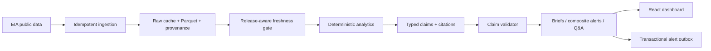

# OilSignal

> **An evidence-first agent for U.S. petroleum fundamentals.** Ingest public oil data, calculate what changed, and generate operational briefs where every market claim carries its evidence.

OilSignal is open-source decision-support software for fuel procurement teams, regional marketers, storage/terminal operators, consultants, and analysts who need a fast, auditable explanation of crude, product inventory, refinery, import, and demand changes. It is **not** a trading bot, does not execute trades, and does not provide price predictions or investment recommendations.


## Why OilSignal

Raw petroleum releases are useful but fragmented. OilSignal keeps the calculation chain explicit:



A model can help explain evidence, but it is never the source of truth. OilSignal works without an LLM using deterministic report templates.

## What is implemented

- Typed petroleum observations with source URL, series ID, observation date, fetch time, and raw SHA-256.
- Idempotent offline fixture ingestion and configurable live EIA v2 ingestion into Parquet with SQLModel run metadata.
- A verified public weekly EIA registry for core crude, gasoline, distillate, PADD 2 distillate, jet fuel, refinery utilization, and crude-import series, last verified **2026-08-26**.
- EIA route/facet discovery CLI for extending and re-verifying registry mappings.
- Fail-closed live ingestion for truncated API responses, duplicate periods from under-constrained facets, invalid frequencies, and non-numeric values.
- Release-calendar-aware WPSR freshness checks with a two-hour EIA API grace window and explicit holiday overrides.
- Provenance-aware live/fixture discrimination so synthetic development data is never treated as a live WPSR feed.
- Transparent week-over-week, four-week average, year-over-year, seasonal-range, and z-score calculations.
- Structured `CalculationTrace`, `Citation`, `Claim`, and `Report` models.
- Claim validator that rejects uncited market claims and unlinked calculation claims.
- Weekly Petroleum Brief, Distillate Supply Risk Brief, and Refinery Utilization Watch in JSON, Markdown, and HTML.
- Single-signal threshold rules plus composite `all`/`any` alert policies with per-condition audit traces.
- Edge-triggered alert state with recovery/re-arm behavior and duplicate suppression.
- Transactional alert outbox with at-least-once delivery, retry state, and delivery receipts.
- FastAPI report, alert-evaluation, readiness, and cited Q&A endpoints.
- React/Vite dashboard showing claims and the evidence table.
- Optional OpenAI-compatible LLM client for local or hosted endpoints.
- Docker Compose, pytest, Ruff, mypy, pre-commit, and GitHub Actions.

The included petroleum fixture is **synthetic test data**, including its development-only `PET.*` identifiers. It exists so tests and the demo run with no network access and must not be presented as current EIA data.

## Quick start: Docker

```bash
git clone https://github.com/Svyable/oil-signal.git
cd oil-signal
docker compose up --build
```

Open:

- Dashboard: `http://localhost:3000`
- FastAPI docs: `http://localhost:8000/docs`
- Liveness: `http://localhost:8000/health`
- Data readiness: `http://localhost:8000/health/ready`

On an empty data volume, Compose loads the synthetic fixture once so the UI is immediately usable. Delete the `oilsignal-data` volume when you intentionally want a clean local data store.

## Local Python development

Python 3.12 is required.

```bash
python3.12 -m venv .venv
source .venv/bin/activate
pip install -e "./backend[dev]"
pytest
ruff check backend tests examples
mypy backend/oilsignal
```

Load the offline fixture and generate a cited brief:

```bash
export OILSIGNAL_DATA_DIR=./data
python examples/ingest_fixture.py
python examples/generate_weekly_brief.py
```

The installed CLI can render the same report path:

```bash
oilsignal report --type weekly --format markdown --data-dir ./data
```

Run the API:

```bash
uvicorn oilsignal.api.app:app --reload --port 8000
```

Run the web UI in another shell:

```bash
cd frontend
npm install
npm run dev
```

## Live EIA ingestion

Tests and the synthetic demo do not require a key. For live connector use:

```bash
export OILSIGNAL_EIA_API_KEY=your-key
```

The included registry uses EIA API v2's documented `seriesid` compatibility route and was verified against EIA public series pages on **2026-08-26**:

```bash
oilsignal ingest-eia --registry examples/eia-series.example.json --data-dir ./data
oilsignal freshness --data-dir ./data
```

For extension or re-verification, inspect EIA routes and facets directly:

```bash
oilsignal eia-metadata --route petroleum/sum/sndw
oilsignal eia-metadata --route petroleum/sum/sndw --facet <facet-id>
```

OilSignal retains raw JSON per configured series, hashes the source payload into each observation, and stores a public dataset URL without the API key. If EIA reports more rows than were returned, ingestion fails rather than accepting a silently truncated history.

For live EIA runs, report, Q&A, and alert paths fail closed when the latest weekly evidence trails the expected WPSR week after the configured publication time plus the two-hour API grace window. Synthetic fixture runs are explicitly excluded from this live freshness gate by ingestion provenance. See [`docs/eia-setup.md`](docs/eia-setup.md) and [`docs/freshness.md`](docs/freshness.md).

## API examples

Generate the structured weekly report:

```bash
curl http://localhost:8000/api/reports/weekly
```

Render Markdown:

```bash
curl "http://localhost:8000/api/reports/weekly/render?format=markdown"
```

Ask a deterministic question against ingested evidence:

```bash
curl -X POST http://localhost:8000/api/ask \
  -H 'content-type: application/json' \
  -d '{"question":"Explain Midwest diesel tightness this week"}'
```

The response contains both `answer` and structured `evidence` objects.

## Composite alerts and delivery

Alert policies are data, not code. The included example requires both a low PADD 2 distillate inventory signal and soft refinery utilization:

```bash
oilsignal alerts-evaluate --rules examples/alerts.example.json --data-dir ./data
```

Stateful evaluation is the CLI default. An inactive-to-active transition updates alert state and enqueues a durable outbox row in the same SQLite transaction. A continuously true policy does not enqueue another notification until it first recovers and re-arms.

Preview without mutating state or enqueueing:

```bash
oilsignal alerts-evaluate --rules examples/alerts.example.json --data-dir ./data --stateless
```

Deliver pending rows through the community console adapter:

```bash
oilsignal alerts-deliver --adapter console --data-dir ./data
```

Delivery is intentionally **at least once**: failed attempts remain retryable and every attempt records status, adapter, attempt count, timestamp, and error/delivery state. A crash after an external provider accepts a message but before OilSignal records success may produce a duplicate on retry, so production adapters should use provider idempotency keys when available. See [`docs/alert-state.md`](docs/alert-state.md).

`POST /api/alerts/evaluate` remains stateless for policy previews; `POST /api/alerts/evaluate/stateful` persists edge-trigger state and enqueues new notifications.

## Scheduling

The CLI is intentionally cron-friendly. A typical self-hosted flow is ingest → verify freshness → evaluate/enqueue → deliver/retry → render:

```bash
# Wednesday after the normal WPSR/API grace window; adjust for your timezone/operations.
45 12 * * 3 cd /srv/oil-signal && .venv/bin/oilsignal ingest-eia --registry examples/eia-series.example.json --data-dir data
50 12 * * 3 cd /srv/oil-signal && .venv/bin/oilsignal freshness --data-dir data
55 12 * * 3 cd /srv/oil-signal && .venv/bin/oilsignal alerts-evaluate --rules config/alerts.json --data-dir data
0 13 * * 3 cd /srv/oil-signal && .venv/bin/oilsignal alerts-deliver --adapter console --data-dir data
5 13 * * 3 cd /srv/oil-signal && .venv/bin/oilsignal report --type weekly --format markdown --data-dir data > /var/reports/oilsignal-weekly.md
```

The release-aware freshness gate—not the example cron clock—is the source of truth. Holiday-delayed weeks will remain stale until the expected release has passed and current evidence arrives.

Email/Slack/Teams implementations can plug into the outbox delivery protocol while preserving the same state, retry, and audit boundaries; the community core does not need a hosted service to generate, inspect, or retry alerts.

## Repository layout

```text
backend/oilsignal/
├── agent/          # typed tools, validator, optional LLM client
├── alerts/         # threshold/composite rules, edge state, transactional delivery outbox
├── analytics/      # deterministic petroleum time-series calculations
├── api/            # FastAPI endpoints
├── data_ingestion/ # EIA client/registry/live ingestion + offline fixtures
├── freshness.py    # WPSR release calendar and stale-data gate
├── reports/        # cited report builders + renderers
└── storage/        # Parquet dataset utilities + SQLModel metadata/outbox
frontend/           # React + TypeScript + Vite
examples/           # offline ingestion, verified EIA registry, alert policies
tests/              # network-free fixtures and acceptance tests
docs/               # architecture, provenance, freshness, safety, open-core model
```

## Safety and product boundary

OilSignal v1 is for **operational decision support**. It deliberately excludes order execution, buy/sell recommendations, portfolio sizing, and price prediction. Missing or stale live evidence must fail closed or omit a section instead of creating a plausible number. See [`docs/agent-safety.md`](docs/agent-safety.md).

## Open core

Community code is Apache-2.0 with no artificial feature lockouts. A commercial hosted product can charge for reliability, scheduled delivery, organization workspaces, SSO/RBAC, private/vendor data connectors, managed retention, VPC/on-prem deployment, and enterprise support. See [`docs/open-core.md`](docs/open-core.md).

## Roadmap

1. Automate periodic re-verification of maintained EIA mappings and expand product-supplied/PADD coverage while preserving stable canonical IDs.
2. Generalize release calendars and freshness policies beyond WPSR-backed weekly series.
3. Add production delivery adapters with provider idempotency, leasing/worker concurrency controls, exponential backoff, and dead-letter operations.
4. Expand the evaluation suite for claim coverage, citation accuracy, alert reproducibility, freshness behavior, and explanation faithfulness.
5. Add optional private connectors and organization knowledge boundaries.
6. Add facility/emissions intelligence using public EPA data after the fundamentals workflow is mature.

## License

Apache-2.0. See [`LICENSE`](LICENSE).
