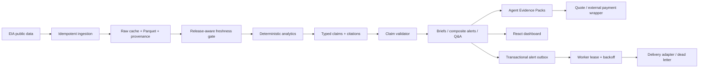

# OilSignal

> **An evidence-first agent for U.S. petroleum fundamentals.** Ingest public oil data, calculate what changed, and generate operational briefs where every market claim carries its evidence.

OilSignal is open-source decision-support software for fuel procurement teams, regional marketers, storage/terminal operators, consultants, and analysts who need a fast, auditable explanation of crude, product inventory, refinery, import/export, production, and demand changes. It is **not** a trading bot, does not execute trades, and does not provide price predictions or investment recommendations.


## Why OilSignal

Raw petroleum releases are useful but fragmented. OilSignal keeps the calculation chain explicit:



A model can help explain evidence, but it is never the source of truth. OilSignal works without an LLM using deterministic report templates.

## What is implemented

- Typed petroleum observations with source URL, series ID, observation date, fetch time, and raw SHA-256.
- Idempotent offline fixture ingestion and configurable live EIA v2 ingestion into Parquet with SQLModel run metadata.
- A maintained weekly EIA registry for crude stocks, field production, imports, exports, refinery crude input, gasoline, distillate, PADD 2 distillate, jet fuel, refinery utilization, and national gasoline/distillate/jet/total-product-supplied demand proxies.
- Executable EIA registry verification that probes every configured route, validates sample shape/numeric data, captures API warnings/version, and optionally enforces WPSR recency.
- A scheduled/manual GitHub workflow for live registry verification when repository secret `EIA_API_KEY` is configured.
- EIA route/facet discovery CLI for extending and re-verifying mappings.
- Fail-closed live ingestion for truncated responses, duplicate periods, invalid frequencies, and non-numeric values.
- Release-calendar-aware WPSR freshness checks with a two-hour EIA API grace window and explicit holiday overrides.
- Provenance-aware live/fixture discrimination so synthetic development data is never treated as a live WPSR feed.
- Transparent week-over-week, four-week average, year-over-year, seasonal-range, and z-score calculations.
- A cited Crude Balance Watch that aligns production/import/export/refinery-input weeks, computes a transparent core-flow balance, converts commercial-stock change to a daily-equivalent rate, and exposes the remaining other/adjustment residual without claiming an official EIA balance identity.
- Structured `CalculationTrace`, `Citation`, `Claim`, and `Report` models.
- Claim validator that rejects uncited market claims and unlinked calculation claims.
- Weekly Petroleum Brief, Distillate Supply Risk Brief, Refinery Utilization Watch, and Crude Balance Watch; live briefs opportunistically include the broader maintained fundamentals set.
- Agent-native Evidence Pack SKUs with well-known discovery, configurable quote metadata, claim/calculation fingerprints, cited raw-source hashes, stable semantic SHA-256 digests, and ETag/304 cache revalidation.
- Single-signal threshold rules plus composite `all`/`any` alert policies with per-condition audit traces.
- Edge-triggered alert state with recovery/re-arm behavior and duplicate suppression.
- Transactional alert outbox with at-least-once delivery, local multi-worker leases, bounded exponential backoff, dead-letter history, requeue, and delivery receipts.
- FastAPI report, alert-evaluation, readiness, agent-product, and cited Q&A endpoints.
- React/Vite dashboard showing claims and the evidence table.
- Optional OpenAI-compatible LLM client for local or hosted endpoints.
- Docker Compose, pytest, Ruff, mypy, pre-commit, and GitHub Actions.

The included petroleum fixture is **synthetic test data**, including its development-only `PET.*` identifiers. It exists so tests and the demo run with no network access and must not be presented as current EIA data.

## Quick start: Docker

```bash
git clone https://github.com/Svyable/oil-signal.git
cd oil-signal
docker compose up --build
```

Open:

- Dashboard: `http://localhost:3000`
- FastAPI docs: `http://localhost:8000/docs`
- Agent product discovery: `http://localhost:8000/.well-known/oilsignal-agent.json`
- Liveness: `http://localhost:8000/health`
- Data readiness: `http://localhost:8000/health/ready`

On an empty data volume, Compose loads the synthetic fixture once so the UI is immediately usable. Delete the `oilsignal-data` volume when you intentionally want a clean local data store.

## Local Python development

Python 3.12 is required.

```bash
python3.12 -m venv .venv
source .venv/bin/activate
pip install -e "./backend[dev]"
pytest
ruff check backend tests examples
mypy backend/oilsignal
```

Load the offline fixture and generate a cited brief:

```bash
export OILSIGNAL_DATA_DIR=./data
python examples/ingest_fixture.py
python examples/generate_weekly_brief.py
```

The installed CLI can render the same report path:

```bash
oilsignal report --type weekly --format markdown --data-dir ./data
```

Run the API:

```bash
uvicorn oilsignal.api.app:app --reload --port 8000
```

Run the web UI in another shell:

```bash
cd frontend
npm install
npm run dev
```

## Live EIA ingestion

Tests and the synthetic demo do not require a key. For live connector use:

```bash
export OILSIGNAL_EIA_API_KEY=your-key
```

Verify the maintained source contract, ingest it, and check the resulting dataset:

```bash
oilsignal eia-verify-registry --registry examples/eia-series.example.json
oilsignal ingest-eia --registry examples/eia-series.example.json --data-dir ./data
oilsignal freshness --data-dir ./data
```

For extension or debugging, inspect EIA routes/facets directly:

```bash
oilsignal eia-metadata --route petroleum/sum/sndw
oilsignal eia-metadata --route petroleum/sum/sndw --facet <facet-id>
```

The verifier checks every route independently and returns a complete audit rather than hiding later failures behind the first broken series. `.github/workflows/eia-registry-verify.yml` can run the probe manually or on its Friday schedule when repository secret `EIA_API_KEY` is configured.

OilSignal retains raw JSON per configured series, hashes source payloads into observations, and stores public dataset URLs without the API key. If EIA reports more rows than were returned, ingestion fails rather than accepting silently truncated history.

For live EIA runs, report, Q&A, alert, and agent Evidence Pack paths fail closed when the latest weekly evidence trails the expected WPSR week after the configured publication time plus the two-hour API grace window. Synthetic fixture runs are explicitly excluded from the live freshness gate by ingestion provenance. See [`docs/eia-setup.md`](docs/eia-setup.md) and [`docs/freshness.md`](docs/freshness.md).

## Reports and API examples

Generate the structured weekly report:

```bash
curl http://localhost:8000/api/reports/weekly
```

Generate the crude flow reconciliation:

```bash
oilsignal report --type crude-balance --format markdown --data-dir ./data
curl http://localhost:8000/api/reports/crude-balance
```

The Crude Balance Watch uses:

```text
core flow balance = production + imports - exports - refinery input
```

It then compares that partial flow result with the daily-equivalent change in commercial crude stocks and reports the difference as an **other/adjustment residual**. That residual is not a forecast error, a trading signal, or an official EIA balance component. See [`docs/crude-balance.md`](docs/crude-balance.md).

Render the standard weekly brief as Markdown:

```bash
curl "http://localhost:8000/api/reports/weekly/render?format=markdown"
```

Ask a deterministic question against ingested evidence:

```bash
curl -X POST http://localhost:8000/api/ask \
  -H 'content-type: application/json' \
  -d '{"question":"What is the crude balance this week?"}'
```

The response contains both `answer` and structured `evidence` objects. Explicit crude production, export, refinery-input, and crude-balance questions route to the corresponding maintained evidence rather than an inventory substitute.

## Agent-native Evidence Packs

OilSignal packages its deterministic intelligence into stable machine products instead of requiring another agent to scrape the dashboard or reverse-engineer report prose.

Discover the catalog:

```bash
curl http://localhost:8000/.well-known/oilsignal-agent.json
```

Advertise a per-pack price without claiming a payment rail is installed:

```bash
export OILSIGNAL_AGENT_EVIDENCE_PACK_PRICE_USD='0.05'
export OILSIGNAL_AGENT_PRICE_CURRENCY='USD'
curl http://localhost:8000/api/agent/products/weekly-petroleum-evidence/quote
```

Fulfill the evidence product:

```bash
curl -i http://localhost:8000/api/agent/products/weekly-petroleum-evidence/evidence
```

The response carries `ETag`, `X-OilSignal-Evidence-SHA256`, and `X-OilSignal-SKU`. A buyer can send the previous ETag via `If-None-Match`; unchanged semantic evidence returns `304 Not Modified` with no body.

An Evidence Pack includes stable claim/calculation fingerprints, only the observations needed by its citations, each cited observation's ingestion `raw_hash`, release-aware freshness state, and a semantic `evidence_sha256`. Runtime timestamps and random internal report IDs do not perturb that digest.

Payment enforcement is deliberately external to the community core. A hosted deployment can put HTTP 402/x402/MPP, credits, or another gateway in front of the same fulfillment endpoint and bind a payment receipt to the returned evidence digest. OilSignal does not advertise a payment protocol until one is actually configured. See [`docs/agent-products.md`](docs/agent-products.md).

## Composite alerts and worker delivery

Alert policies are data, not code. The included example requires both low PADD 2 distillate inventory and soft refinery utilization:

```bash
oilsignal alerts-evaluate --rules examples/alerts.example.json --data-dir ./data
```

Stateful evaluation atomically updates edge state and enqueues a durable outbox row on an inactive-to-active transition. A continuously true policy does not enqueue again until recovery/re-arm.

Preview without mutating state:

```bash
oilsignal alerts-evaluate --rules examples/alerts.example.json --data-dir ./data --stateless
```

Drain eligible rows with an explicit worker identity and retry policy:

```bash
oilsignal alerts-deliver \
  --adapter console \
  --data-dir ./data \
  --worker-id worker-1 \
  --lease-seconds 120 \
  --max-attempts 5 \
  --base-backoff-seconds 30 \
  --max-backoff-seconds 3600
```

Claims use short expiring SQLite leases, so multiple local processes sharing one metadata database cannot actively own the same notification. Failed rows back off exponentially; exhausted rows become dead letters.

```bash
oilsignal alerts-dead-letters --data-dir ./data
oilsignal alerts-requeue --outbox-id out_... --data-dir ./data
```

Delivery remains intentionally **at least once**. A crash after an external provider accepts a message but before local acknowledgement can still cause a retry, so production adapters should use provider idempotency based on `outbox_id`. See [`docs/alert-state.md`](docs/alert-state.md).

## Scheduling

The CLI is cron-friendly. A typical self-hosted flow is verify source contract → ingest → verify dataset freshness → evaluate/enqueue → deliver/retry → render:

```bash
# Wednesday after the normal WPSR/API grace window; adjust for your timezone/operations.
45 12 * * 3 cd /srv/oil-signal && .venv/bin/oilsignal eia-verify-registry --registry examples/eia-series.example.json
50 12 * * 3 cd /srv/oil-signal && .venv/bin/oilsignal ingest-eia --registry examples/eia-series.example.json --data-dir data
55 12 * * 3 cd /srv/oil-signal && .venv/bin/oilsignal freshness --data-dir data
0 13 * * 3 cd /srv/oil-signal && .venv/bin/oilsignal alerts-evaluate --rules config/alerts.json --data-dir data
5 13 * * 3 cd /srv/oil-signal && .venv/bin/oilsignal alerts-deliver --adapter console --data-dir data
10 13 * * 3 cd /srv/oil-signal && .venv/bin/oilsignal report --type weekly --format markdown --data-dir data > /var/reports/oilsignal-weekly.md
15 13 * * 3 cd /srv/oil-signal && .venv/bin/oilsignal report --type crude-balance --format markdown --data-dir data > /var/reports/oilsignal-crude-balance.md
```

The release-aware freshness gate—not the example clock—is the source of truth. Holiday-delayed weeks remain stale until the expected release and current evidence arrive.

Email/Slack/Teams implementations can plug into the same adapter/outbox boundary. The SQLite lease implementation is designed for multiple local workers sharing one database; a future horizontally distributed hosted deployment should use a server database/queue rather than treating SQLite as a distributed broker.

## Repository layout

```text
backend/oilsignal/
├── agent/          # typed tools, validator, evidence products, optional LLM client
├── alerts/         # threshold/composite rules, edge state, leased delivery
├── analytics/      # deterministic petroleum time-series + crude-flow reconciliation
├── api/            # FastAPI endpoints
├── data_ingestion/ # EIA client/registry/verification/live ingestion + fixtures
├── freshness.py    # WPSR release calendar and stale-data gate
├── reports/        # cited report builders + renderers
└── storage/        # Parquet data + SQLModel state/outbox/leases/dead letters
frontend/           # React + TypeScript + Vite
examples/           # offline ingestion, maintained EIA registry, alert policies
tests/              # network-free fixtures and acceptance tests
docs/               # architecture, provenance, freshness, balance, agent products, safety
```

## Safety and product boundary

OilSignal v1 is for **operational decision support**. It deliberately excludes order execution, buy/sell recommendations, portfolio sizing, and price prediction. Missing or stale live evidence must fail closed or omit a section instead of creating a plausible number. Partial balance calculations are labeled as such and must not be presented as official EIA accounting identities. See [`docs/agent-safety.md`](docs/agent-safety.md).

## Open core

Community code is Apache-2.0 with no artificial feature lockouts. A commercial hosted product can charge for reliability, scheduled delivery, organization workspaces, SSO/RBAC, private/vendor data connectors, managed retention, agent Evidence Pack fulfillment/payment infrastructure, VPC/on-prem deployment, and enterprise support. See [`docs/open-core.md`](docs/open-core.md).

## Roadmap

1. Add provider-neutral HTTP 402 payment enforcement for agent Evidence Packs, with receipts bound to `evidence_sha256`, while keeping the deterministic product schema payment-rail independent.
2. Add agent-native delta/event products so buyers can purchase only new petroleum changes instead of repeatedly consuming a full weekly pack.
3. Expand verified PADD crude/product coverage and add more explicit supply-disposition components without weakening canonical-series or citation contracts.
4. Generalize release calendars and freshness policies beyond WPSR-backed weekly series.
5. Expand the evaluation suite for claim coverage, citation accuracy, balance reconciliation, alert reproducibility, freshness behavior, and explanation faithfulness.
6. Add optional private connectors and organization knowledge boundaries.
7. Add facility/emissions intelligence using public EPA data after the fundamentals workflow is mature.

## License

Apache-2.0. See [`LICENSE`](LICENSE).
