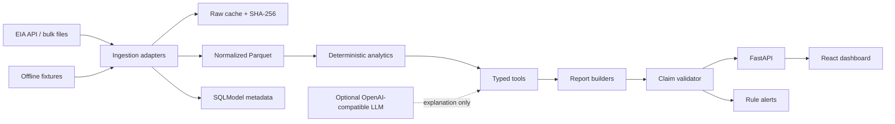

# Architecture

OilSignal separates facts, calculations, claims, and delivery so a language model is never the system of record.

## Design rules

1. **Evidence before prose.** Ingestion creates typed observations with a source URL, series ID, observation date, fetch time, and raw payload hash.
2. **Math before narrative.** Week-over-week, four-week average, year-over-year, seasonal range, and anomaly calculations produce explicit `CalculationTrace` objects.
3. **Claims are typed.** A claim contains its text, citation objects, and optional calculation trace.
4. **Validation is a hard gate.** Reports are rejected when a market claim has no citations or a calculation is not linked back to cited observations.
5. **LLMs are optional.** The deterministic template path is the default and fully functional without a model.
6. **Delivery is downstream.** Alerts and report delivery consume validated objects; they never invent new market facts.

## Extension points

- `EIAClient` is the public-data adapter boundary.
- `MetricSpec` makes report composition data-driven.
- `DeliveryAdapter` is the boundary for console, email, Slack, Teams, or customer-specific delivery.
- `OpenAICompatibleLLM` can point at a local model server or hosted compatible endpoint.
- Organization workspaces, SSO, premium connectors, and managed reliability can live outside the Apache-2.0 core without weakening the core interfaces.
